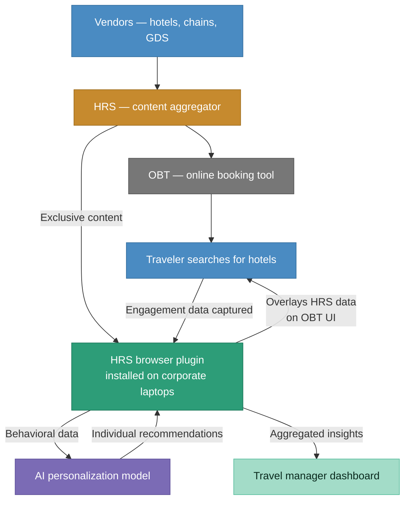
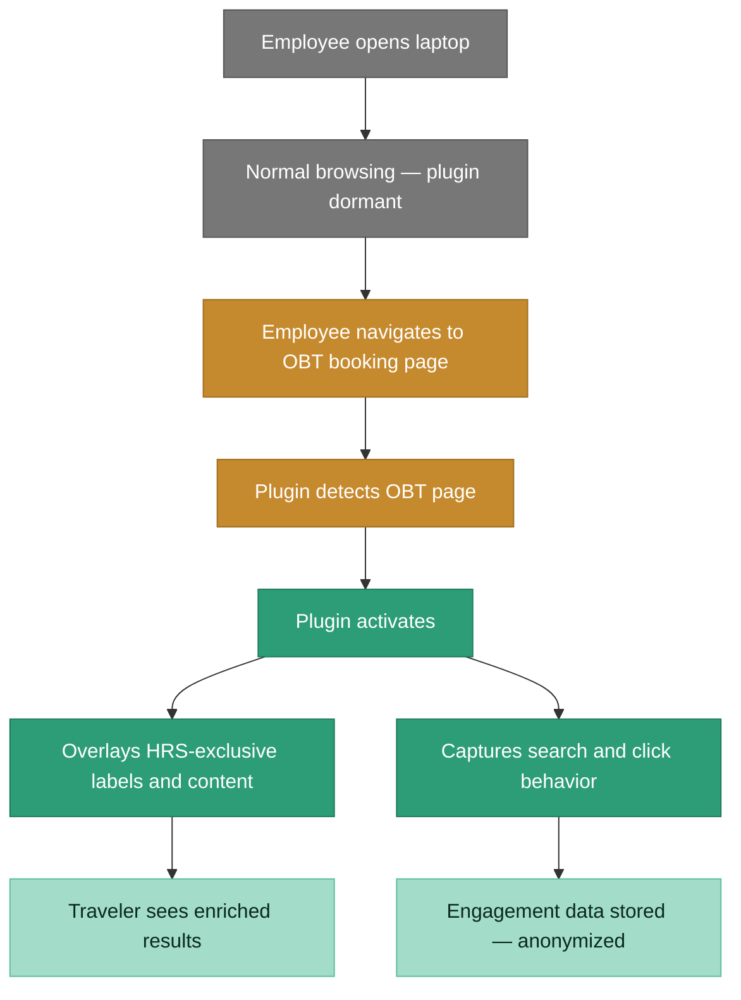
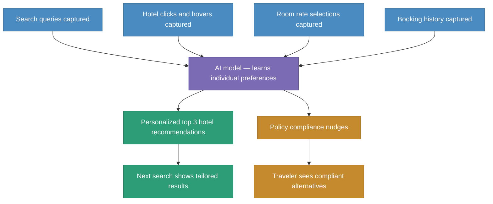
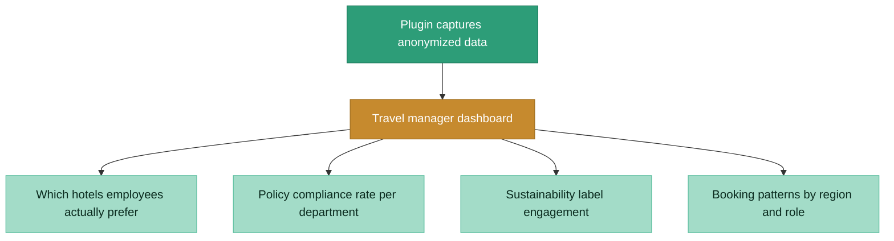

# After state: browser plugin bypasses the black box

> Plugin overlays HRS content directly on the OBT UI, captures engagement data, and feeds an AI personalization layer. No OBT cooperation required.

### How the plugin activates

### AI personalization flow

### What travel managers now see

## Before vs. after comparison

| Dimension | Before | After |
|-----------|--------|-------|
| **Engagement data** | Zero. OBTs keep everything. | Full capture: searches, clicks, hovers, bookings, per individual traveler. |
| **New feature visibility** | 1-2+ years waiting for OBT adoption | Immediate. Plugin overlays new content directly, no OBT cooperation needed. |
| **Personalization** | None. Same generic results for everyone. | AI model generates individualized top 3 recommendations based on behavior. |
| **Travel manager visibility** | Internal surveys only. Slow, incomplete. | Real-time dashboard: preferences, policy compliance, sustainability engagement. |
| **Policy compliance** | ~40-45%, no way to nudge travelers | 15% improvement via non-blocking nudges showing compliant alternatives. |
| **Sustainability** | Labels invisible if OBT didn't implement them | 2.5% improvement in sustainability-compliant bookings via plugin overlay. |
| **Conversion rate** | Baseline | 12% improvement in hotel booking conversion. |
| **Customer retention** | At risk (two strategic accounts threatening to leave) | 60% improvement in retention among plugin customers. |
| **Plugin activity** | N/A | Dormant 99.99% of the time. Only active on OBT booking pages. |
| **Data privacy** | N/A | All engagement data anonymized. No non-travel data collected. Third-party pen testing passed. |

## Key architectural decisions

**Why a browser plugin, not an API-level solution:**
An API-level approach would require OBT cooperation, which was the exact bottleneck we were trying to bypass. The plugin operates at the browser layer, above the OBT, and can overlay content and capture data without any changes to the OBT's code.

**Why dormant by default, active only on OBT pages:**
This was a product decision driven by IT security requirements. Enterprise IT departments would not approve software that monitored all browsing activity. Making the plugin dormant 99.99% of the time and only activating on recognized OBT domains was what got IT sign-off.

**Why anonymized data shared with travel managers, not individual-level:**
Travel managers needed behavioral insights to improve policy compliance, but individual-level tracking would have raised privacy concerns and created internal resistance. The AI personalization happens on the HRS side; travel managers see aggregated trends, not individual profiles.

**Why the plugin UI matches each OBT's native look:**
If the plugin overlay looked visually different from the OBT, users would distrust it or ignore it. Designing the plugin to match each OBT's native UI meant travelers couldn't distinguish plugin-injected content from native content, which was critical for adoption and engagement.
