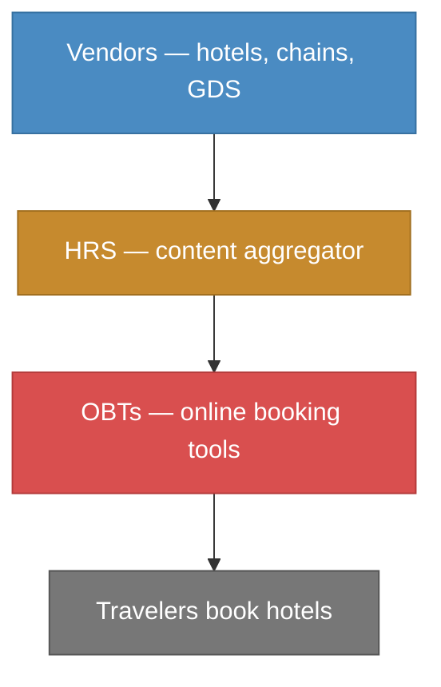
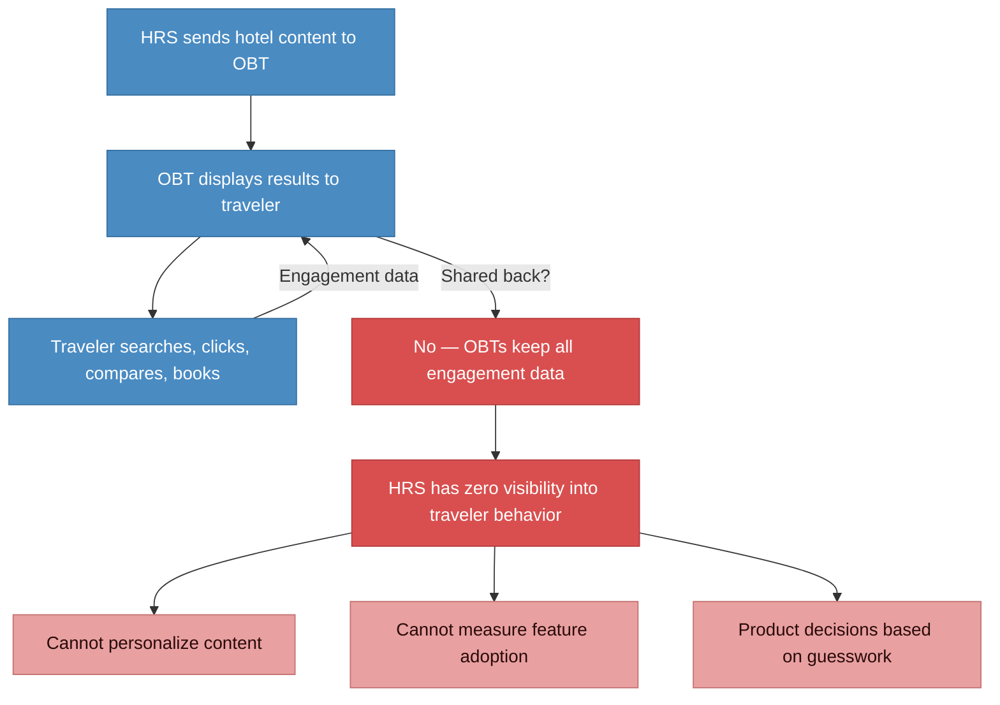
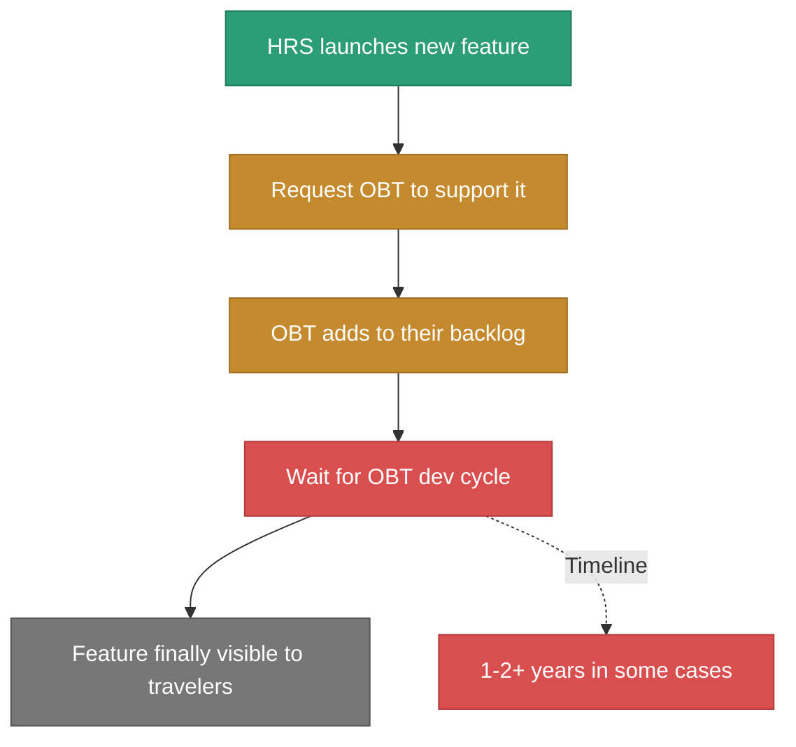
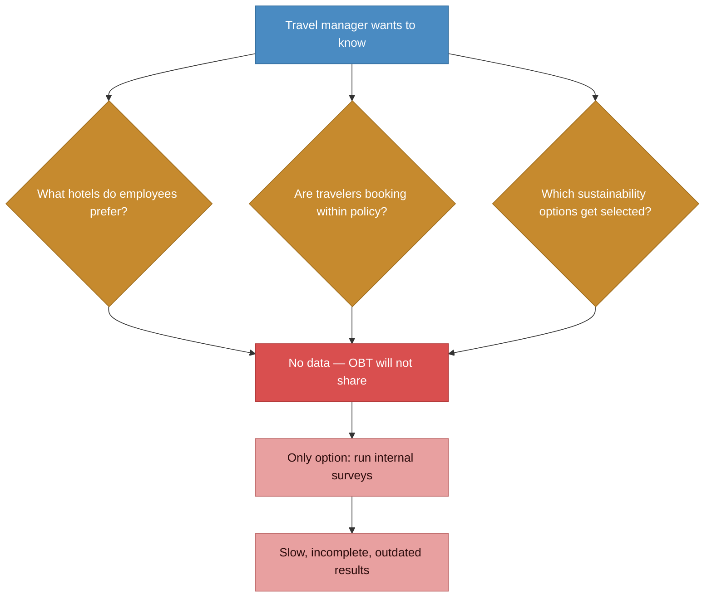

# Before state: black-box value chain

> Every layer hoards its data. HRS has zero visibility into traveler behavior. New features take 1-2+ years to reach end users.

### The data black-box problem

### The feature adoption delay

### What travel managers experienced

## Pain points summary

| Problem | Impact |
|---------|--------|
| **OBTs don't share engagement data** | HRS cannot see what travelers search, click, compare, or prefer. Product decisions based on aggregate booking volumes and anecdotes. |
| **New features take 1-2+ years to reach travelers** | OBTs have hardcoded logic. Getting them to add support for a new content type (e.g. sustainability certification) requires their dev cycle. One case took 2+ years for a single name addition. |
| **Travel managers have no visibility** | Cannot see what their employees actually book or prefer. Only option is internal surveys, which are slow and incomplete. |
| **No personalization possible** | Without behavioral data, every traveler sees the same generic results. No ability to learn individual preferences. |
| **Competitive content stays invisible** | HRS-exclusive features (negotiated rates, sustainability programs) remain hidden if OBTs don't implement them. |
